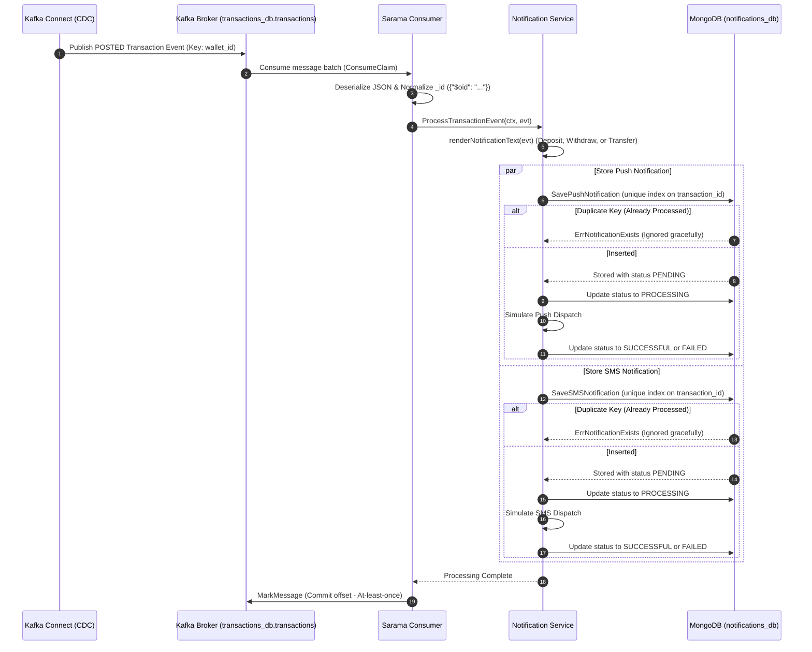

# 🔔 Notifications Service (`svc-notifications`)

> **Status:** Active Microservice — Asynchronous event-driven notification engine consuming transaction events from Kafka to deliver Push & SMS alerts.

---

## 📌 Overview

The **Notifications Service** is a decoupled Go microservice responsible for dispatching real-time transactional alerts (Push Notifications and SMS) to users following balance-altering events. 

Key capabilities:
- **Event-Driven Architecture:** Consumes Change Data Capture (CDC) events emitted to Kafka by Kafka Connect from the `transactions_db.transactions` collection.
- **Deduplication & Exactly-Once Delivery:** Uses MongoDB unique indexes on `transaction_id` to guarantee idempotent message processing even under Kafka at-least-once re-deliveries.
- **Dynamic Multi-Channel Templating:** Renders tailored message templates for deposits, withdrawals, and sender/receiver transfer legs with Egyptian timestamp formatting.
- **Delivery Lifecycle Tracking:** Tracks notification progress (`PENDING` $\rightarrow$ `PROCESSING` $\rightarrow$ `SUCCESSFUL` / `FAILED`) with audit logging.
- **Fault-Tolerant Consumer:** Features poison pill tripwires, extended JSON `_id` normalization, and bounded exponential backoff retries.
- **Distributed Observability:** Integrated with OpenTelemetry tracing and structured logging via Zerolog.

---

## 🏗 Architecture

```
svc-notifications/
├── cmd/
│   └── main.go                     # Service bootstrap, Kafka consumer initialization, & graceful shutdown
├── api/
│   └── grpcserver/                 # gRPC Delivery Layer (prepared for direct synchronous dispatch)
│       └── notifications_server.go # Implements notificationsv1.NotificationServiceServer
├── internal/
│   └── notifications/              # Core Domain Layer
│       ├── model.go                # PushNotification & SMSNotification schemas, lifecycle statuses
│       ├── dto.go                  # TransactionEvent wire model, Push/SMS requests & responses
│       ├── repository.go           # Repository interface contract
│       └── service.go              # Event processing, template rendering, and delivery dispatch
├── external/
│   ├── kafka/                      # Kafka Messaging Integration
│   │   └── consumer/
│   │       └── consumer.go         # Sarama ConsumerGroupHandler with offset commits and retries
│   └── mongodb/                    # Infrastructure Layer (Data Access)
│       ├── connection.go           # MongoDB client setup & connection lifecycle
│       └── repo.go                 # MongoDB repository (unique transaction indexes & status updates)
├── util/
│   ├── common/                     # Helper utilities
│   ├── logger/                     # Zerolog structured logging with trace ID propagation
│   └── tracer/                     # OpenTelemetry tracer configuration
├── Dockerfile                      # Multi-stage Alpine Docker build
└── go.mod
```

### Clean Architecture Layers

| Layer | Package | Responsibility |
|-------|---------|----------------|
| **Messaging / Ingestion** | `external/kafka/consumer` | Connects to Kafka brokers, handles rebalances, deserializes CDC payloads, normalizes MongoDB extended JSON, and manages partition offset commits. |
| **Domain (Core)** | `internal/notifications` | Derives notification intent, formats message strings, orchestrates dual-channel delivery (Push + SMS), and enforces idempotency rules. |
| **Infrastructure** | `external/mongodb` | Stores notifications in `push_notifications` and `sms_notifications` collections with unique index constraints. |
| **Transport (gRPC)** | `api/grpcserver` | Prepared gRPC endpoints (`SendSMSNotification`, `SendPushNotification`) for direct inter-service RPC invocations. |
| **Utilities** | `util/logger`, `util/tracer` | Structured logging and distributed tracing instrumentation. |

---

## ⚙️ End-to-End Event Processing Flow



### 1. Change Stream Ingestion via Kafka Connect
- Kafka Connect uses `MongoSourceConnector` configured in `kafka-connect/mongo-source.properties`.
- It monitors the `transactions_db.transactions` collection and publishes only `operationType: insert` where `status: POSTED`.
- The event value is delivered to the `transactions_db.transactions` topic with key equal to `wallet_id`.

### 2. Message Normalization & Tripwire Protection
- The connector serializes MongoDB `_id` as an extended JSON string: `{"$oid": "6701a350c4d5e6f7a8b9c0d3"}`.
- The consumer detects and extracts the inner 24-character hexadecimal OID.
- **Poison Pill Tripwire:** If an event has an empty `_id`, the consumer skips it loudly and commits the offset to prevent corrupt records from causing collision crashes on the unique index.

### 3. Template Rendering Engine
The service dynamically inspects the transaction type and whether the target recipient is the sender or receiver:

| Event Condition | Derived Type | Message Template |
|-----------------|--------------|------------------|
| `type == "DEPOSIT"` | `DEPOSIT` | `"Deposit of {Amount} to your wallet of phone number: {PhoneNumber} completed at {Date, Time}. New balance: {BalanceAfter}."` |
| `type == "WITHDRAWAL"` | `WITHDRAWAL` | `"Withdrawal of {Amount} from your wallet of phone number: {PhoneNumber} completed at {Date, Time}. New balance: {BalanceAfter}."` |
| `type == "TRANSFER"` & `Phone == SenderPhone` | `TRANSFER_SENDER` | `"Transfer of {Amount} from your wallet of phone number: {PhoneNumber} to phone number: {ReceiverPhone} completed at {Date, Time}. New balance: {BalanceAfter}."` |
| `type == "TRANSFER"` & `Phone != SenderPhone` | `TRANSFER_RECEIVER` | `"Transfer of {Amount} to your wallet of phone number: {PhoneNumber} from phone number: {SenderPhone} completed at {Date, Time}. New balance: {BalanceAfter}."` |

### 4. Idempotency & Status Lifecycle
- **Deduplication:** A unique index on `transaction_id` (`unique_transaction`) in both `push_notifications` and `sms_notifications` prevents duplicate alerts if Kafka re-delivers the message.
- If a duplicate key is detected, `ErrNotificationExists` is returned and logged as an informational event, allowing the consumer to advance its offset without error.
- **Lifecycle States:**
  - `PENDING` $\rightarrow$ Document inserted.
  - `PROCESSING` $\rightarrow$ Dispatch initiated.
  - `SUCCESSFUL` $\rightarrow$ Simulated delivery succeeded (90% probability).
  - `FAILED` $\rightarrow$ Dispatch failed, error reason stored in `failed_reason`.

---

## 🗄 Data Model

### Collections: `push_notifications` and `sms_notifications`

```json
{
  "_id": {"$oid": "6701b540c4d5e6f7a8b9c0e1"},
  "phone_number": "+201012345678",
  "device_token": "+201012345678",
  "title": "Transfer Notification",
  "message_content": "Deposit of 5000 to your wallet of phone number: +201012345678 completed at 06 Sep 2026, 10:02. New balance: 5000.",
  "event_type": "DEPOSIT",
  "status": "SUCCESSFUL",
  "amount": 5000,
  "balance": 5000,
  "transaction_id": "6701a350c4d5e6f7a8b9c0d3",
  "wallet_id": "6701a2b3c4d5e6f7a8b9c0d1",
  "national_id": "",
  "failed_reason": "",
  "created_at": "2026-09-06T10:02:05Z",
  "updated_at": "2026-09-06T10:02:06Z"
}
```

### Database Indexes

| Collection | Index Name | Keys | Properties | Purpose |
|------------|------------|------|------------|---------|
| `push_notifications` | `unique_transaction` | `{"transaction_id": 1}` | `Unique: true` | Prevents duplicate push notifications per transaction |
| `sms_notifications` | `unique_transaction` | `{"transaction_id": 1}` | `Unique: true` | Prevents duplicate SMS notifications per transaction |

---

## 🚀 Getting Started

### Prerequisites
- **Go 1.22+** (Go 1.26 toolchain)
- **MongoDB** instance
- **Apache Kafka** broker running with topic `transactions_db.transactions` created
- **Kafka Connect** with MongoDB Source Connector configured

### Configuration (`.ENV`)

Create `.ENV` in `svc-notifications/`:

```env
MONGO_URI=mongodb://localhost:27017
MONGO_DB_NAME=notifications_db
GRPC_SERVER_PORT=50050
KAFKA_BROKERS=localhost:9092
KAFKA_GROUP_ID=notifications-group
KAFKA_TOPIC=transactions_db.transactions
```

| Variable | Required | Default | Description |
|----------|:--------:|:-------:|-------------|
| `MONGO_URI` | ✅ | — | MongoDB connection string |
| `MONGO_DB_NAME` | ❌ | `notifications_db` | Database name for notification logs |
| `KAFKA_BROKERS` | ✅ | — | Comma-separated list of Kafka brokers (e.g. `localhost:9092` or `kafka:9092`) |
| `KAFKA_GROUP_ID` | ✅ | — | Consumer group ID (e.g. `notifications-group`) |
| `KAFKA_TOPIC` | ✅ | — | Topic containing transaction change events (`transactions_db.transactions`) |
| `GRPC_SERVER_PORT` | ❌ | `50050` | gRPC server port (if enabling synchronous gRPC mode) |

### Run Locally

```bash
cd Notifications-Service/svc-notifications
go run ./cmd
```

### Run with Docker

```bash
cd Notifications-Service/svc-notifications
docker build -t svc-notifications .
docker run -p 50050:50050 \
  -e MONGO_URI="mongodb+srv://<user>:<password>@cluster.mongodb.net" \
  -e MONGO_DB_NAME="notifications_db" \
  -e KAFKA_BROKERS="kafka:9092" \
  -e KAFKA_GROUP_ID="notifications-group" \
  -e KAFKA_TOPIC="transactions_db.transactions" \
  svc-notifications
```

---

## 📡 gRPC Contract (Prepared Mode)

The service includes generated protobuf code and server implementations for synchronous dispatch via `notifications.v1.NotificationService`:

```protobuf
service NotificationService {
    rpc SendSMSNotification(SendNotificationRequest) returns (SendNotificationResponse) {}
    rpc SendPushNotification(SendNotificationRequest) returns (SendNotificationResponse) {}
}
```

*In current deployment mode, asynchronous Kafka consumption is the primary ingestion channel, with the gRPC server stubbed for future synchronous escalation requirements.*
